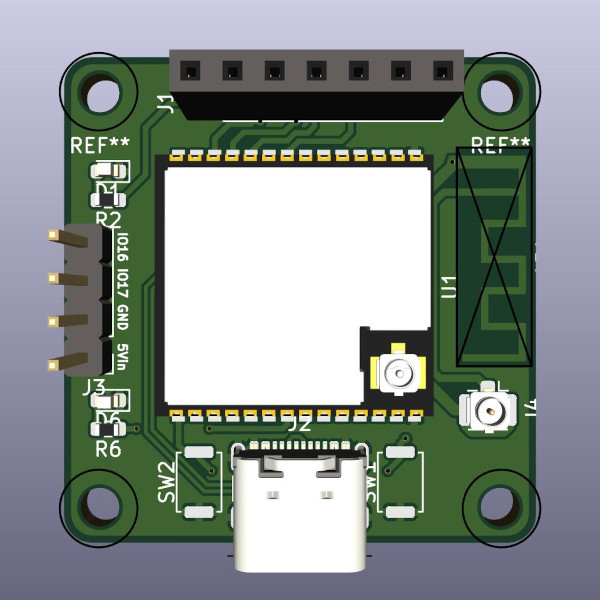

# Multisensor Mini

### Default config

File multisensor-mini.yaml is basic example config with default settings to start with, it is used just to verify that all interfaces are working. It includes following components:
- MQ-7 Carbon Monoxide Gas Sensor
